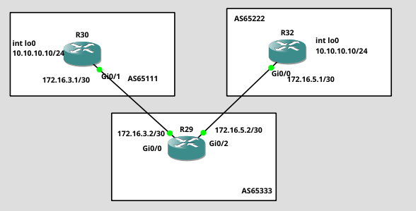

# Cisco BGP Weight Lab

## Overview

This lab demonstrates BGP path selection using the Cisco-specific
Weight attribute.

The topology consists of three autonomous systems:

- AS65111 – R30
- AS65222 – R32
- AS65333 – R29

The main goal of the lab was to observe how the BGP Weight attribute
affects the best-path selection process.

## Topology

## Technologies

- Cisco IOS
- BGP
- Loopback interfaces
- IPv4
- GNS3

## Addressing

| Router | AS | Loopback |
|--------|----|----------|
| R30 | 65681 | 10.10.10.10/24 |
| R32 | 65681 | 10.10.10.10/24 |

## Lab Objectives
1. Weight is a Cisco-specific BGP attribute.
2. Weight is significant only on the local router.
3. Weight is not advertised to BGP neighbors.
4. The path with the highest Weight is preferred.
5. Routes learned from a BGP neighbor have a default Weight of 0.
6. Locally originated routes have a default Weight of 32768.

## Verification

Useful commands:

    show ip bgp summary
    show ip bgp
    show ip route bgp
    show ip bgp <prefix>
    traceroute <destination> <source>

## Key Findings

Cisco Weight is a locally significant BGP attribute.

A route with a higher Weight value is preferred over a route with
a lower Weight value.

The Weight attribute is not advertised to other BGP routers.

## Configuration

Router configurations are available in the `configs/` directory.
