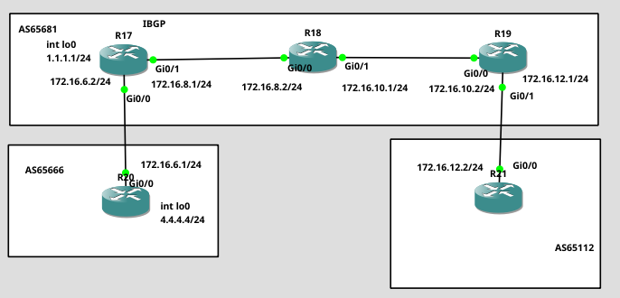

# Cisco BGP Route-Reflector Lab

## Overview

This lab demonstrates BGP path selection using the Cisco-specific
Weight attribute.

The topology consists of three autonomous systems:

- AS65681 – internal BGP network
- AS65666 – external BGP neighbor
- AS65112 – external BGP neighbor

The main goal of the lab was to observe how the BGP Weight attribute
affects the best-path selection process.

## Topology

## Technologies

- Cisco IOS
- BGP
- iBGP
- eBGP
- Loopback interfaces
- IPv4
- GNS3

## Addressing

| Router | AS | Loopback |
|--------|----|----------|
| R17 | 65681 | 1.1.1.1/32 |
| R18 | 65681 | 2.2.2.2/32 |
| R19 | 65681 | 3.3.3.3/32 |
| R20 | 65666 | 4.4.4.4/32 |
| R21 | 65112 | 5.5.5.5/32 |

## Lab Objectives
1. Configure OSPF inside AS65681 to provide connectivity to Loopback's
2. Configure iBGP inside AS65681.
3. Configure eBGP connections to AS65666 and AS65112.
4. Advertise networks using BGP.
5. Modify the Weight attribute.
6. Verify how Weight influences BGP best-path selection.

## Verification

Useful commands:

    show ip bgp summary
    show ip bgp
    show ip route bgp
    show ip bgp <prefix>
    traceroute <destination> <source>

## Key Findings

A Route Reflector (RR) is used in iBGP to reduce the need for a full-mesh topology between all BGP routers.

The Route Reflector can advertise routes learned from one iBGP client to other iBGP clients, bypassing the standard iBGP split-horizon rule.

Using a Route Reflector significantly reduces the number of required iBGP sessions and improves scalability in larger networks.

## Configuration

Router configurations are available in the `configs/` directory.
