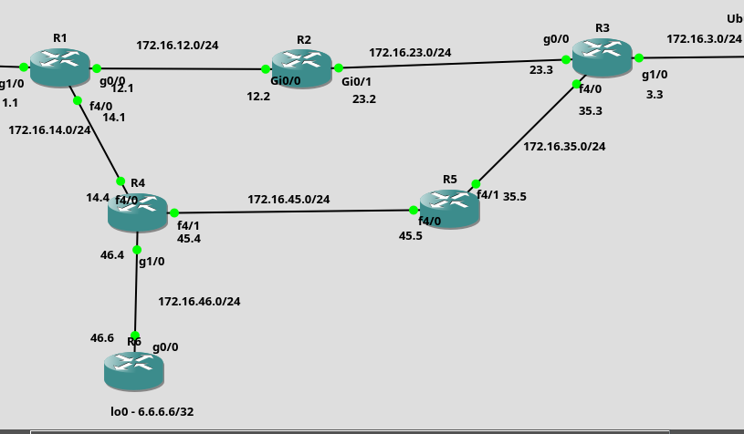

# EIGRP Lab

## Overview

This lab demonstrates the configuration and operation of **EIGRP** in a multi-router Cisco IOS network simulated in GNS3.

The topology contains six routers with redundant paths, allowing EIGRP to demonstrate neighbor discovery, metric calculation, successor and feasible successor selection, and convergence.

## Topology




## Technologies

- Cisco IOS
- EIGRP
- IPv4
- Dynamic Routing
- GNS3

## Addressing

### Router-to-Router Networks

| Connection | Network | Router Addresses |
|------------|---------|------------------|
| R1 – R2 | 172.16.12.0/24 | R1: 172.16.12.1 / R2: 172.16.12.2 |
| R2 – R3 | 172.16.23.0/24 | R2: 172.16.23.2 / R3: 172.16.23.3 |
| R3 – R5 | 172.16.35.0/24 | R3: 172.16.35.3 / R5: 172.16.35.5 |
| R4 – R5 | 172.16.45.0/24 | R4: 172.16.45.4 / R5: 172.16.45.5 |
| R4 – R6 | 172.16.46.0/24 | R4: 172.16.46.4 / R6: 172.16.46.6 |
| R1 – R4 | 172.16.14.0/24 | R1: 172.16.14.1 / R4: 172.16.14.4 |

### Loopback

| Router | Loopback |
|--------|----------|
| R6 | 6.6.6.6/32 |

## Quick Verification

```text
show ip route eigrp
show ip eigrp neighbors
show ip eigrp topology
show ip eigrp topology all-links
show ip protocols
```

Connectivity test:

```text
R1# ping 6.6.6.6
R1# traceroute 6.6.6.6
```

## Lab Objectives

1. Configure EIGRP on all routers.
2. Establish EIGRP neighbor relationships.
3. Advertise connected networks and R6 loopback.
4. Verify EIGRP routes and topology table.
5. Identify successors and feasible successors.
6. Analyze EIGRP metrics and Administrative Distance.
7. Test connectivity and simulate link failure.
8. Observe EIGRP convergence and alternative paths.


## Summary

This lab demonstrates how Cisco IOS EIGRP operates in a redundant IPv4 network, including neighbor discovery, metric calculation, topology table, route selection and convergence.

The topology is simulated using **GNS3** and Cisco IOS routers.
