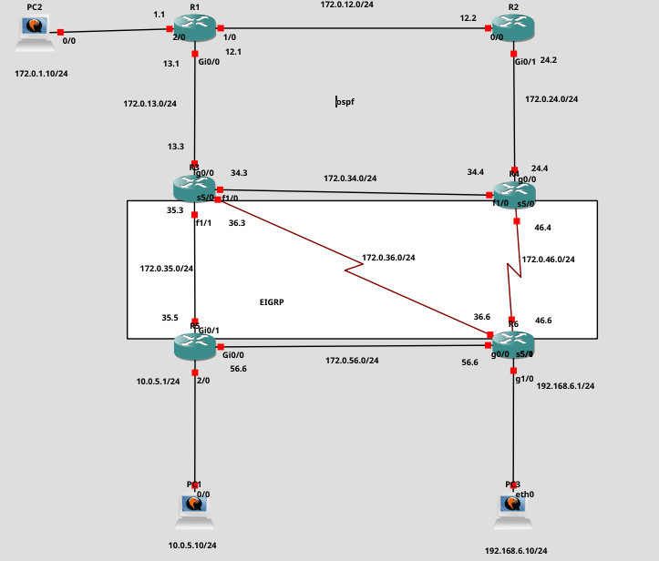

# OSPF + EIGRP - Route Redistribution

## Overview

This lab demonstrates **route redistribution between OSPF and EIGRP** in a Cisco IOS network simulated in GNS3.

The topology is divided into two routing domains:

- **OSPF** – used in the upper part of the topology
- **EIGRP** – used in the lower part of the topology

R3 participates in both OSPF and EIGRP and serves as the main point for exchanging routing information between the two routing domains.

The topology contains multiple paths between routers, which makes it possible to observe how OSPF and EIGRP calculate routes, how redistributed routes appear in the routing table, and how routing protocols select the best available path.

---

## Topology



The network consists of six routers and three end devices.

### OSPF Domain

The OSPF domain includes:

- R1
- R2
- R3
- R4

### EIGRP Domain

The EIGRP domain includes:

- R3
- R5
- R6

R3 participates in both routing protocols and is responsible for redistributing routes between OSPF and EIGRP.

---

## Technologies

- Cisco IOS
- OSPFv2
- EIGRP
- Route Redistribution
- IPv4
- Dynamic Routing
- Loopback Interfaces
- Routing Metrics
- Administrative Distance
- GNS3

---

## Addressing

### Router Loopbacks

| Router | Routing Protocol | Loopback |
|--------|------------------|----------|
| R1 | OSPF | 1.1.1.1/32 |
| R2 | OSPF | 2.2.2.2/32 |
| R3 | OSPF / EIGRP | 3.3.3.3/32 |
| R4 | OSPF | 4.4.4.4/32 |
| R5 | EIGRP | 5.5.5.5/32 |
| R6 | EIGRP | 6.6.6.6/32 |

### Router-to-Router Networks

| Connection | Network |
|------------|---------|
| R1 – R2 | 172.0.12.0/24 |
| R1 – R3 | 172.0.13.0/24 |
| R2 – R4 | 172.0.24.0/24 |
| R3 – R4 | 172.0.34.0/24 |
| R3 – R5 | 172.0.35.0/24 |
| R3 – R6 | 172.0.36.0/24 |
| R4 – R6 | 172.0.46.0/24 |
| R5 – R6 | 172.0.56.0/24 |

### End-Device Networks

| Connection | Network |
|------------|---------|
| PC2 – R1 | 172.0.1.0/24 |
| R5 – PC1 | 10.0.5.0/24 |
| R6 – PC3 | 192.168.6.0/24 |

---

## OSPF

OSPF is configured on R1, R2, R3 and R4.

The OSPF domain provides dynamic routing between the routers located in the upper part of the topology.

OSPF uses a **cost-based metric** to calculate the best path to a destination.

The following networks are advertised within the OSPF domain:

```text
172.0.1.0/24
172.0.12.0/24
172.0.13.0/24
172.0.24.0/24
172.0.34.0/24
