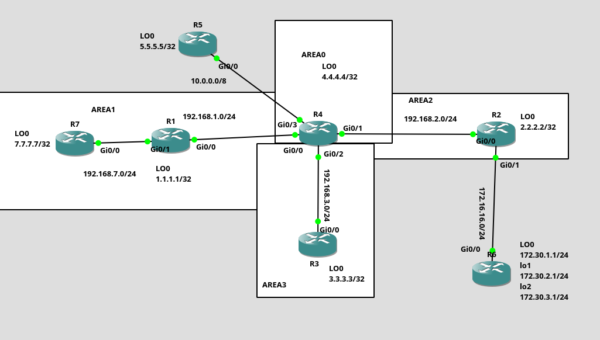

# OSPF Multi-Area Lab

## Overview

This lab demonstrates OSPF operation in a multi-area network using different OSPF area types and external route redistribution.

The topology consists of four OSPF areas:

* **Area 0** – Standard Backbone Area
* **Area 1** – Totally Stubby Area
* **Area 2** – NSSA (Not-So-Stubby Area)
* **Area 3** – Standard Area

R4 acts as the central **Area Border Router (ABR)** connecting Areas 1, 2 and 3 to Area 0.

The topology also contains two **Autonomous System Boundary Routers (ASBRs)**:

* **R4** acts as an ABR and ASBR. It has a static route toward R5 which is redistributed into OSPF as an **E1 external route**.
* **R2** acts as an ASBR inside Area 2 (NSSA). It redistributes external networks reachable through R6 into OSPF as **External Type 2 routes**. Because R2 is located inside an NSSA, these routes are introduced into the area as **N2 routes using Type 7 LSAs**.

The main goal of the lab is to observe how different OSPF area types affect route propagation, external route redistribution and LSA behavior.

---

## Topology



---

## Technologies

* Cisco IOS
* OSPFv2
* Multi-Area OSPF
* Area Border Router (ABR)
* Autonomous System Boundary Router (ASBR)
* Totally Stubby Area
* NSSA
* Route Redistribution
* Static Routing
* OSPF E1 / E2
* OSPF N2
* Type 3 LSA
* Type 5 LSA
* Type 7 LSA
* Loopback Interfaces
* IPv4
* GNS3

---

## Addressing

| Router | Area               | Role            | Loopback                                    |
| ------ | ------------------ | --------------- | ------------------------------------------- |
| R1     | Area 1             | Internal Router | 1.1.1.1/32                                  |
| R2     | Area 2             | ASBR            | 2.2.2.2/32                                  |
| R3     | Area 3             | Internal Router | 3.3.3.3/32                                  |
| R4     | Area 0 / 1 / 2 / 3 | ABR / ASBR      | 4.4.4.4/32                                  |
| R5     | External           | External Router | 5.5.5.5/32                                  |
| R6     | External           | External Router | 172.30.1.1/24, 172.30.2.1/24, 172.30.3.1/24 |
| R7     | Area 1             | Internal Router | 7.7.7.7/32                                  |

### Network Links

| Connection | Network        |
| ---------- | -------------- |
| R7 – R1    | 192.168.7.0/24 |
| R1 – R4    | 192.168.1.0/24 |
| R4 – R2    | 192.168.2.0/24 |
| R4 – R3    | 192.168.3.0/24 |
| R4 – R5    | 10.0.0.0/8     |
| R2 – R6    | 172.16.16.0/24 |

---

## Lab Objectives

1. Configure OSPF in a multi-area topology.
2. Configure **Area 0** as the OSPF backbone.
3. Configure **Area 1** as a Totally Stubby Area.
4. Configure **Area 2** as an NSSA.
5. Configure **Area 3** as a standard OSPF area.
6. Configure R4 as the central **ABR**.
7. Configure a static route on R4 toward the external network behind R5.
8. Redistribute the static route on R4 into OSPF as an **E1 route**.
9. Configure R2 as an **ASBR inside the NSSA**.
10. Redistribute external networks reachable through R6 on R2 using External Type 2.
11. Verify that routes redistributed by R2 appear inside the NSSA as **O N2**.
12. Observe **Type 7 LSA** generation by the NSSA ASBR.
13. Observe **Type 7 to Type 5 LSA translation** performed by the NSSA ABR.
14. Compare route propagation between Standard, Totally Stubby and NSSA areas.

---

## Verification

Useful commands:

```
show ip ospf
show ip ospf neighbor
show ip ospf interface brief
show ip route ospf
show ip ospf database
show ip ospf database summary
show ip ospf database external
show ip ospf database nssa-external
show ip protocols
show ip route
ping <destination>
traceroute <destination>
```

Important OSPF route codes:

```
O       - OSPF intra-area
O IA    - OSPF inter-area
O E1    - OSPF external type 1
O E2    - OSPF external type 2
O N1    - OSPF NSSA external type 1
O N2    - OSPF NSSA external type 2
O*IA    - OSPF inter-area default route
```

---

## Key Findings

A **Totally Stubby Area** reduces the amount of routing information advertised into the area.

Area 1 does not receive individual external routes and most inter-area routes. Instead, R4 provides a default route:

```
O*IA 0.0.0.0/0
```

R1 and R7 can use this default route to reach destinations outside Area 1.

An **NSSA** provides stub-like behavior while still allowing an ASBR to exist inside the area and redistribute external routes.

R2 acts as an **ASBR inside Area 2** and redistributes external networks reachable through R6 using an External Type 2 metric.

Because R2 is located inside an NSSA, the redistributed routes are introduced using **Type 7 LSAs** and appear inside Area 2 as:

```
O N2
```

R4 acts as the NSSA ABR and translates the appropriate:

```
Type 7 LSA -> Type 5 LSA
```

After the translation, the routes redistributed by R2 can be advertised through the rest of the OSPF domain as:

```
O E2
```

R4 also acts as an **ASBR** because it redistributes a static route toward R5 into OSPF.

The route is redistributed using External Type 1 and appears in areas that accept external LSAs as:

```
O E1
```

For an **E1 route**, the metric includes the external metric and the internal OSPF cost toward the ASBR.

For an **E2 route**, the external metric is the primary metric and normally remains unchanged as the route propagates through the OSPF domain.

This topology therefore contains:

```
R2 = ASBR
R4 = ABR + ASBR
```

The lab demonstrates the behavior of several important OSPF LSA types:

* **Type 1** – Router LSA
* **Type 2** – Network LSA
* **Type 3** – Summary LSA
* **Type 5** – AS External LSA
* **Type 7** – NSSA External LSA

---

## Configuration

Router configurations are available in the `configs/` directory.
