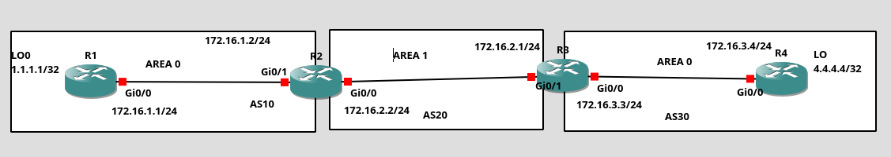

# EIGRP + OSPF - Route Redistribution

## Overview

This lab demonstrates **route redistribution between multiple EIGRP and OSPF routing domains** in a Cisco IOS network simulated in GNS3.

The main objective of the lab is to demonstrate how routes can be redistributed between different routing processes of the same routing protocol.

The project focuses on two separate redistribution scenarios:

- **EIGRP → EIGRP** – redistribution between different EIGRP autonomous systems
- **OSPF → OSPF** – redistribution between different OSPF processes / areas

The topology contains multiple routing domains connected through R2 and R3, which act as boundary routers between the individual routing domains.

This allows observation of:

- route redistribution,
- routing protocol metrics,
- administrative distance,
- route selection,
- routing information exchange between independent routing processes,
- differences between EIGRP and OSPF redistribution.

---

## Topology



The network consists of four routers:

- R1
- R2
- R3
- R4

The topology is divided into three routing domains.

### Domain 1

R1 is connected to R2 through the `172.16.1.0/24` network.

```text
R1 ---------------- R2
    172.16.1.0/24
```

### Domain 2

R2 is connected to R3 through the `172.16.2.0/24` network.

```text
R2 ---------------- R3
    172.16.2.0/24
```

### Domain 3

R3 is connected to R4 through the `172.16.3.0/24` network.

```text
R3 ---------------- R4
    172.16.3.0/24
```

R2 and R3 act as **boundary routers**, connecting the independent routing domains.

---

## Technologies

- Cisco IOS
- EIGRP
- OSPFv2
- Route Redistribution
- IPv4
- Dynamic Routing
- Loopback Interfaces
- Routing Metrics
- Administrative Distance
- GNS3

---

## Addressing

### Router Loopbacks

| Router | Loopback |
|--------|----------|
| R1 | 1.1.1.1/32 |
| R2 | 2.2.2.2/32 |
| R3 | 3.3.3.3/32 |
| R4 | 4.4.4.4/32 |

Loopback interfaces are used as additional routing destinations and allow the behavior of route redistribution to be easily verified.

### Router-to-Router Networks

| Connection | Network | Router Addresses |
|------------|---------|------------------|
| R1 – R2 | 172.16.1.0/24 | R1: 172.16.1.1 / R2: 172.16.1.2 |
| R2 – R3 | 172.16.2.0/24 | R2: 172.16.2.1 / R3: 172.16.2.2 |
| R3 – R4 | 172.16.3.0/24 | R3: 172.16.3.3 / R4: 172.16.3.4 |

---

# EIGRP

EIGRP is used to create separate routing domains.

The topology contains multiple EIGRP autonomous systems:

```text
AS10 ---- AS20 ---- AS30
```

Routes learned in one EIGRP autonomous system are not automatically exchanged with another EIGRP autonomous system.

Therefore, **route redistribution** is required to exchange routing information between the different EIGRP processes.

The lab demonstrates redistribution:

```text
EIGRP AS10
     |
     | redistribution
     v
EIGRP AS20
     |
     | redistribution
     v
EIGRP AS30
```

The redistribution process allows routes learned by one EIGRP process to be injected into another EIGRP process.

### EIGRP Redistribution

When redistributing routes between EIGRP processes, an appropriate EIGRP metric must be provided.

Example:

```text
redistribute eigrp 10 metric 10000 100 255 1 1500
```

The metric consists of:

- bandwidth
- delay
- reliability
- load
- MTU

This is important because EIGRP requires a valid metric when external routes are redistributed into the protocol.

---

# OSPF

The topology also contains multiple OSPF routing domains.

The OSPF sections are represented by different areas:

```text
AREA 0 ---- AREA 1 ---- AREA 0
```

R2 and R3 connect separate OSPF sections.

The purpose of this part of the lab is to demonstrate redistribution between independent OSPF routing processes.

Unlike normal communication between OSPF areas, the project intentionally uses separate OSPF processes so that route redistribution is required.

---

## OSPF Redistribution

Routes learned by one OSPF process are redistributed into another OSPF process.

The general configuration follows the concept:

```text
OSPF process 1
      |
      | redistribution
      v
OSPF process 2
      |
      | redistribution
      v
OSPF process 3
```

Redistributed routes appear as **external OSPF routes**.

Depending on the configuration, routes may appear in the routing table as:

```text
O E1
```

or

```text
O E2
```

where:

- **E1** – external metric includes the internal OSPF cost to reach the redistribution point
- **E2** – external metric is primarily based on the external metric itself

---

# Route Redistribution

The main objective of this lab is to compare two different redistribution scenarios.

## EIGRP → EIGRP

Routes from one EIGRP autonomous system are redistributed into another EIGRP autonomous system.

```text
EIGRP AS10
     |
     | redistribute
     v
EIGRP AS20
     |
     | redistribute
     v
EIGRP AS30
```

This demonstrates how EIGRP routing information can be exchanged between independent autonomous systems.

---

## OSPF → OSPF

Routes from one OSPF process are redistributed into another OSPF process.

```text
OSPF AREA 0
     |
     | redistribute
     v
OSPF AREA 1
     |
     | redistribute
     v
OSPF AREA 0
```

This demonstrates how independent OSPF routing processes can exchange routes through redistribution.

---

# Important Concepts

The following concepts are investigated during the lab:

### Administrative Distance

Administrative Distance determines which routing source is preferred when multiple routing protocols provide a route to the same destination.

Common default values:

| Protocol | Administrative Distance |
|----------|-------------------------|
| EIGRP Internal | 90 |
| OSPF | 110 |
| EIGRP External | 170 |

### Routing Metrics

Different routing protocols use different metrics.

**EIGRP** uses a composite metric based primarily on:

- bandwidth
- delay
- reliability
- load

**OSPF** uses:

- cost

When routes are redistributed, the destination protocol must be able to assign an appropriate metric to the imported route.

### External Routes

Redistributed routes are considered external to the destination routing protocol.

For example, an OSPF route redistributed from another OSPF process can appear as:

```text
O E1
```

or:

```text
O E2
```

Similarly, EIGRP routes redistributed from another EIGRP autonomous system are treated as external EIGRP routes.

---

# Verification

The following commands can be used to verify the configuration and routing information.

### Routing Table

```text
show ip route
```

### OSPF Routes

```text
show ip route ospf
```

### EIGRP Routes

```text
show ip route eigrp
```

### OSPF Neighbors

```text
show ip ospf neighbor
```

### OSPF Information

```text
show ip ospf
```

### EIGRP Neighbors

```text
show ip eigrp neighbors
```

### EIGRP Topology

```text
show ip eigrp topology
```

### Redistribution Verification

```text
show ip protocols
```

This command is particularly useful for verifying:

- active routing protocols,
- routing processes,
- networks being advertised,
- redistribution configuration,
- administrative distances.

---

# Testing

Connectivity between routing domains can be tested using:

```text
ping
```

and:

```text
traceroute
```

Example:

```text
R1# ping 4.4.4.4
```

The routing table should contain a valid path to the remote loopback network.

The path can also be examined using:

```text
R1# traceroute 4.4.4.4
```

This allows verification of the actual forwarding path between the routing domains.

---

# Lab Objectives

The main objectives of the lab are:

1. Configure multiple EIGRP routing processes.
2. Configure multiple OSPF routing processes.
3. Establish routing adjacencies within individual routing domains.
4. Configure EIGRP → EIGRP redistribution.
5. Configure OSPF → OSPF redistribution.
6. Configure appropriate routing metrics.
7. Verify redistributed routes.
8. Analyze Administrative Distance.
9. Compare internal and external routes.
10. Verify end-to-end connectivity between all routing domains.

---

# Expected Results

After completing the configuration, routers should be able to reach networks located in remote routing domains.

For example:

```text
R1 → R4
R4 → R1
```

The routing tables should contain routes learned through redistribution.

The lab should demonstrate that:

- routes are not automatically exchanged between independent routing processes,
- redistribution is required to exchange routing information,
- redistributed routes are treated as external routes,
- routing metrics must be correctly configured,
- Administrative Distance influences route selection,
- bidirectional redistribution can introduce routing loops if not properly controlled.

---

# Summary

This lab demonstrates **route redistribution between independent routing domains using both EIGRP and OSPF**.

The first part focuses on:

```text
EIGRP AS10 → AS20 → AS30
```

while the second part focuses on:

```text
OSPF AREA 0 → AREA 1 → AREA 0
```

The project provides a practical demonstration of how Cisco IOS handles route redistribution, external routes, routing metrics and route selection in a multi-domain network.

The topology is simulated using **GNS3** and Cisco IOS routers.
